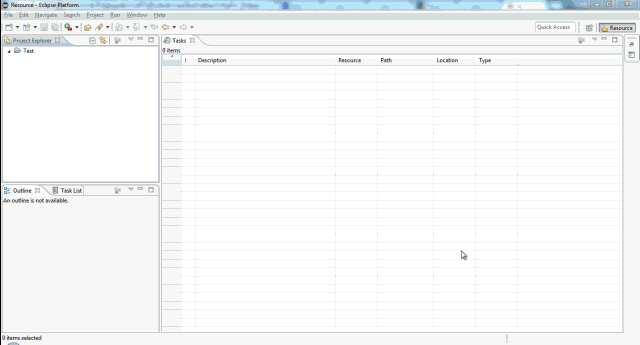

# jaexcel

This git repo is a eclipse workspace that was built and tested with eclipse-rcp-mars-2-win32 using Java7. In this build of eclipse it is also advisable to install EMF in order to build the project correctly.

Add the files in the "pt.iul.iscte.dcti.pa.jaxel/libs" to the class path of the project.

Dependencies added directly on the repository and not via some package manager system due to technical reasons that made the build of the software overly complicated.